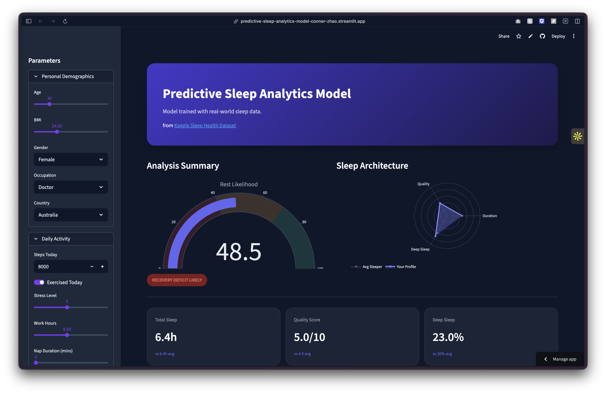

# Predictive Sleep Analytics Model
 
An end-to-end machine learning project that predicts personalized sleep outcomes from daily habits, lifestyle inputs, and demographic information — deployed as an interactive Streamlit dashboard with real-time SHAP explainability.
 
**Dataset:** [Sleep Health & Daily Performance — Kaggle](https://www.kaggle.com/datasets/mohankrishnathalla/sleep-health-and-daily-performance-dataset)
 
---
 
## Demo
 
> Adjust sliders for stress, exercise, caffeine, work hours, and more — get instant predictions with a breakdown of what's helping or hurting your sleep.
 

 
---
 
## Project Summary
 
| | |
|---|---|
| **Dataset** | 100,000 rows × 32 columns |
| **Models** | XGBoost Regressor + XGBoost Classifier |
| **Outcomes Predicted** | Sleep Duration, Sleep Quality Score, Deep Sleep %, Felt Rested |
| **Best R²** | 0.69 (Sleep Quality Score) |
| **Classifier Accuracy** | 72% (Felt Rested) |
| **Dashboard** | Streamlit + Plotly |
 
---
 
## Project Structure
 
```
sleep-predictor/
│
├── sleep_analysis.ipynb       # Full EDA + feature engineering + model training
├── app.py                     # Streamlit dashboard
│
├── models/
│   ├── regressor.pkl          # Trained XGBoost regressor
│   ├── classifier.pkl         # Trained XGBoost classifier
│   ├── feature_cols.pkl       # Encoded feature column names
│   └── ordinal_order.pkl      # Ordinal encoding map
│
└── README.md
```
 
---
 
## How It Works
 
### Phase 1 — Exploratory Data Analysis
- Audited 32 columns for missingness, outliers, and distributions
- Generated a correlation heatmap between effecting factors and outcome variables
- Identified `felt_rested` as binary (requiring a classifier rather than regressor)
- Found `stress_score` (r = -0.64) and `work_hours_that_day` (r = -0.44) as the strongest predictors of sleep quality
 
### Phase 2 — Feature Engineering & Modeling
- Applied ordinal encoding to `sleep_disorder_risk` (Healthy → Mild → Moderate → Severe)
- Applied one-hot encoding to all remaining categoricals (gender, occupation, country, chronotype, mental health, season, day type), expanding to 57 total features
- Trained two XGBoost models: a multi-output regressor for continuous outcomes and a binary classifier for `felt_rested`
- Identified and resolved a data leakage issue where outcome-adjacent variables (`rem_percentage`, `cognitive_performance_score`, etc.) were leaking into the feature set, artificially inflating classifier accuracy to 100%
- Ran `RandomizedSearchCV` hyperparameter tuning — confirmed data signal ceiling rather than model configuration as the performance bottleneck
 
### Phase 3 — Streamlit Dashboard
- Sidebar inputs organized into four collapsible sections: Demographics, Daily Activity, Personal Habits & Environment, Context
- Real-time predictions rendered on every input change
- Radar chart benchmarks user's predicted sleep profile against dataset averages
- SHAP-powered feature impact analysis across three tabbed outcome views (Quality, Duration, Deep Sleep)
- Personalized insight cards surfacing each user's single biggest sleep booster and biggest drag
 
---
 
## Model Performance
 
| Outcome | MAE | R² |
|---|---|---|
| Sleep Duration (hrs) | 0.58 hrs | 0.66 |
| Sleep Quality Score | 0.67 pts | 0.69 |
| Deep Sleep % | 2.76% | 0.33 |
| Felt Rested (classifier) | — | 72% accuracy |
 
> **Note:** `deep_sleep_percentage` underperforms relative to other outcomes (R² = 0.33), likely because deep sleep is more strongly driven by biological factors not captured in behavioral/demographic data. This is surfaced to users in the dashboard.
 
---
 
## Running Locally
 
**1. Clone the repo**
```bash
git clone https://github.com/your-username/sleep-predictor.git
cd sleep-predictor
```
 
**2. Install dependencies**
```bash
pip install streamlit plotly shap xgboost scikit-learn pandas numpy joblib
```
 
**3. Train the models** *(skip if using pre-trained .pkl files)*
```bash
jupyter notebook sleep_analysis.ipynb
# Run all cells — models will be saved to /models
```
 
**4. Launch the dashboard**
```bash
streamlit run app.py
```
 
---
 
## Tech Stack
 
| Tool | Purpose |
|---|---|
| Python | Core language |
| pandas / numpy | Data manipulation |
| scikit-learn | Preprocessing, train/test split, evaluation |
| XGBoost | Gradient boosted tree models |
| SHAP | Model explainability |
| Streamlit | Dashboard framework |
| Plotly | Interactive charts |
| joblib | Model serialization |
 
---
 
## Key Learnings
 
- **Data leakage is subtle** — outcome-adjacent variables (e.g. REM %, cognitive performance score) look like valid features but encode the answer, inflating evaluation metrics artificially
- **Hyperparameter tuning has diminishing returns** — when tuning produces no improvement, the bottleneck is usually feature signal, not model configuration
- **SHAP adds real value to dashboards** — raw predicted scores are less actionable than knowing *which specific input* is driving them
 
---
 
## License
 
MIT License — free to use and adapt with attribution.